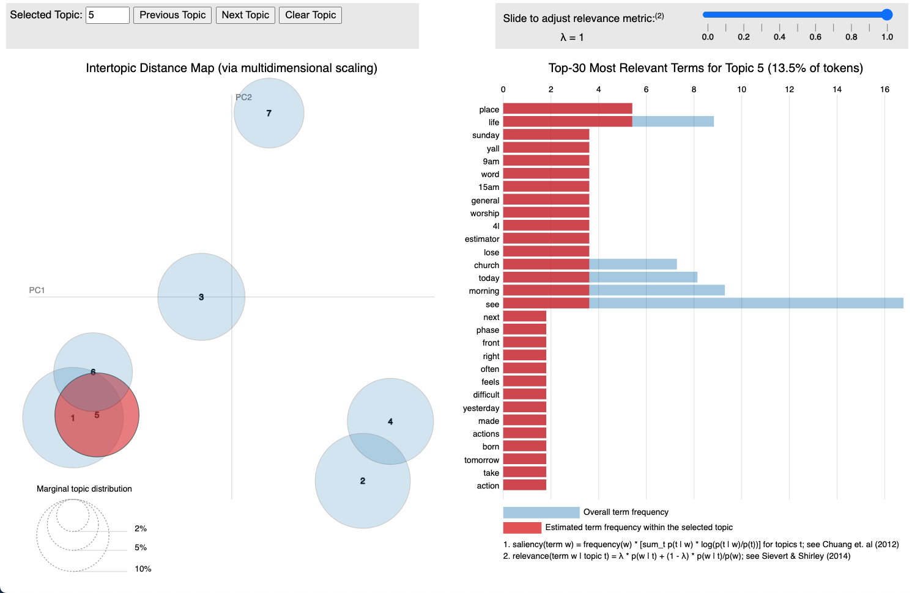
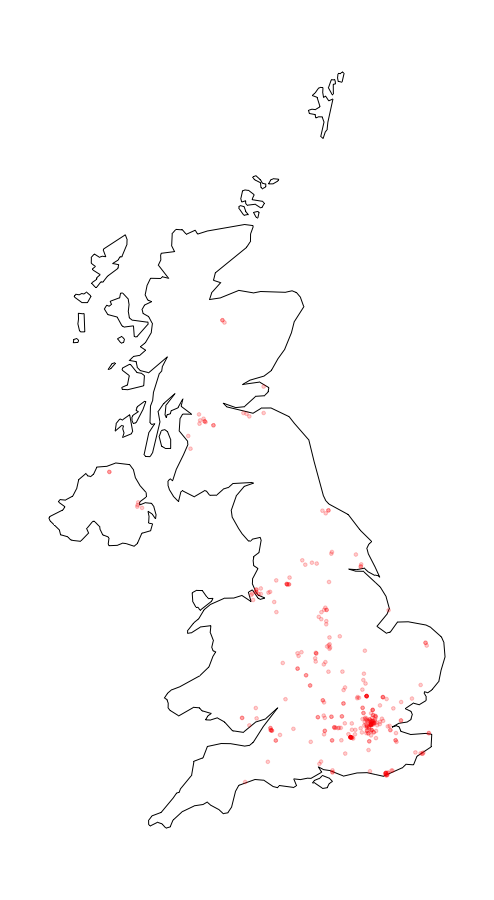
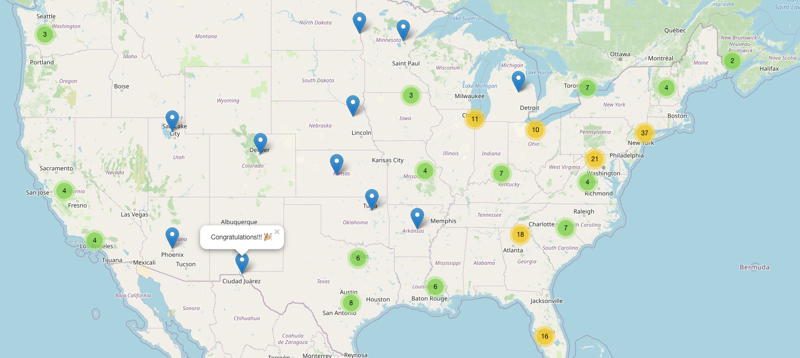

```{r echo=FALSE}
knitr::opts_chunk$set(
  collapse = TRUE,
  comment = "#>",
  fig.path = "man/figures/README-"
)
options(width = 100)
library(Twitmo)
library(magrittr)
```

# Twitmo 

<!-- badges: start -->

[](https://github.com/abuchmueller/Twitmo/actions) [](https://opensource.org/licenses/MIT)

<!-- badges: end -->

The goal of `Twitmo` is to facilitate topic modeling in R with Twitter data. `Twitmo` provides a broad range of methods to sample, pre-process and visualize contents of geo-tagged tweets to make modeling the public discourse easy and accessible.

## Installation

You can install `Twitmo` from CRAN with:

```{r cran-installation, eval=FALSE}
install.packages("Twitmo")
```

You can install `Twitmo` from GitHub with:

Before you install from Github make sure you have Rtools for [Windows](https://cran.r-project.org/bin/windows/Rtools/ "Rtools for Windows (CRAN)") or [macOS](https://thecoatlessprofessor.com/programming/cpp/r-compiler-tools-for-rcpp-on-macos/ "Rtools for macOS") already installed.

```{r gh-installation, eval = FALSE}
## install remotes package if it's not already
if (!requireNamespace("remotes", quietly = TRUE)) {
  install.packages("remotes")
}

## install dev version of Twitmo from github
remotes::install_github("abuchmueller/Twitmo")
```

## Collecting geo-tagged tweets

Make sure you have a regular Twitter Account before start to sample your tweets.

```{r eval=FALSE}
# Live stream tweets from the UK for 30 seconds and save to "uk_tweets.json" in current working directory
get_tweets(method = 'stream', 
           location = "GBR", 
           timeout = 30, 
           file_name = "uk_tweets.json")

# Use your own bounding box to stream US mainland tweets
get_tweets(method = 'stream', 
           location = c(-125, 26, -65, 49), 
           timeout = 30,
           file_name = "tweets_from_us_mainland.json")
```

## Load your tweets from a json file into a data frame

A small sample with raw tweets is included in the package. Access via:

```{r message=FALSE, warning=FALSE}
raw_path <- system.file("extdata", "tweets_20191027-141233.json", package = "Twitmo")
mytweets <- load_tweets(raw_path)
```

## Pool tweets into long pseudo-document

```{r}
pool <- pool_tweets(mytweets)
pool.corpus <- pool$corpus
pool.dfm <- pool$document_term_matrix
```

## Find optimal number of topics

```{r ldatuner, warning=FALSE}
find_lda(pool.dfm)
```

## Fitting a LDA model

```{r}
model <- fit_lda(pool.dfm, n_topics = 7)
```

## View most relevant terms for each topic

```{r}
lda_terms(model)
```

or which hashtags are heavily associated with each topic

```{r}
lda_hashtags(model)
```

## Inspecting LDA distributions

Check the distribution of your LDA Model with

```{r}
lda_distribution(model)
```

# Filtering tweets

Sometimes you can build better topic models by blacklisting or whitelisting certain keywords from your data. You can do this with a keyword dictionary using the `filter_tweets()` function. In this example we exclude all tweets with "football" or "mood" in them from our data.

```{r}
mytweets %>% dim()
filter_tweets(mytweets, keywords = "football,mood", include = FALSE) %>% dim()
```

Analogously if you want to run your collected tweets through a whitelist use

```{r}
mytweets %>% dim()
filter_tweets(mytweets, keywords = "football,mood", include = TRUE) %>% dim()
```

# Fiting a STM

Structural topic models can be fitted with additional external covariates. In this example we metadata that comes with the tweets such as retweet count. This works with parsed unpooled tweets. Pre-processing and fitting is done with one function.

```{r echo=TRUE, results='hide'}
stm_model <- fit_stm(mytweets, n_topics = 7, xcov = ~ retweet_count + followers_count + reply_count + quote_count + favorite_count,
                     remove_punct = TRUE,
                     remove_url = TRUE,
                     remove_emojis = TRUE,
                     stem = TRUE,
                     stopwords = "en")
```

STMs can be inspected via

```{r}
summary(stm_model)
```

## Visualizing models with `LDAvis`

Make sure you have `LDAvis` and `servr` installed.

```{r ldavis-intallation, eval = FALSE}
## install LDAvis package if it's not already
if (!requireNamespace("LDAvis", quietly = TRUE)) {
  install.packages("LDAvis")
}

## install servr package if it's not already
if (!requireNamespace("servr", quietly = TRUE)) {
  install.packages("servr")
}
```

Export fitted models into interactive `LDAvis` visualizations with one line of code

```{r, eval=FALSE}
to_ldavis(model, pool.corpus, pool.dfm)
## for STM use (included in the stm package)
stm::toLDAvis(stm_model, stm_model$prep$documents)
```



## Plotting geo-tagged tweets

Plot your tweets onto a static map

```{r fig.width = 6}
plot_tweets(mytweets, region = "USA(?!:Alaska|:Hawaii)", alpha=0.1)
```

or plot the distribution of a certain hashtag onto a static map (UK data not included)

```{r eval=FALSE}
plot_hashtag(uk_tweets, region = "UK", hashtag = "foodwaste", ignore_case=TRUE, alpha=0.2)
```



## Interactive maps with `leaflet`

Use scroll wheel to zoom into and out of the map. Click markets to see tweets. Make sure you have the `leaflet` package installed.

```{r eval=FALSE}
## install leaflet package if it's not already
if (!requireNamespace("leaflet", quietly = TRUE)) {
  install.packages("leaflet")
}

cluster_tweets(mytweets)
```


