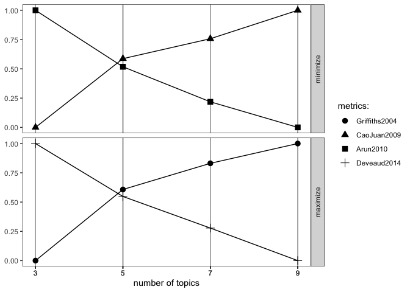

# TweetLocViz

The goal of `TweetLocViz` is to facilitate topic modeling in R with
Twitter data. `TweetLocViz` provides a broad range of methods to sample,
pre-process and visualize Tweets to make modeling the public discourse
easy and accessible. This `README` covers the most important features.
For more details use `vignette("TweetLocViz")`.

## Installation

You can install `TweetLocViz` from CRAN with:

``` r
install.packages("TweetLocViz")
```

You can install `TweetLocViz` from github with:

``` r
## install remotes package if it's not already
if (!requireNamespace("remotes", quietly = TRUE)) {
  install.packages("remotes")
}

## install dev version of TweetLocViz from github
remotes::install_github("abuchmueller/TweetLocViz")
```

## Example: Collect your tweets

Make sure you have a regular Twitter Account before start to sample your
Tweets. For more sophisticated sampling you’ll need a developer account.
Use `vignette("sampling", package = "TweetLocViz")` to learn more about
Twitter’s endpoints.

### Work in Progress: Use included examples for now as `get_tweets()` is not well documented.

``` r
# get_tweets()
```

## Parse your tweets

``` r
dat <- parse_stream("inst/extdata/tweets 20191027-141233.json")
#> opening file input connection.
#>  Found 167 records... Found 193 records... Imported 193 records. Simplifying...
#> closing file input connection.
```

## Pool tweets into document pools

``` r
pool <- pool_tweets(dat)
#> 
#> 193 Tweets found
#> Pooling 35 Tweets with Hashtags
#> 36 Unique Hashtags found
#> Begin pooling ...Done
pool.corpus <- pool$corpus
```

``` r
pool.dfm <- pool$document_term_matrix
```

## Find optimal number of topics

``` r
find_lda(pool.dfm)
```

<!-- -->

## Fit LDA model

``` r
model <- fit_lda(pool.dfm, n_topics = 3)
```

## View most relevant terms for each topic

``` r
lda_terms(model)
#>           Topic.1   Topic.2   Topic.3
#> 1  #puppiesatplay       job      meet
#> 2           paola      link     first
#> 3            says       bio      last
#> 4         #chinup     click      good
#> 5   #sundayfunday       see     music
#> 6  #saintsgameday    hiring  downtown
#> 7     #instapuppy       can knoxville
#> 8           #woof recommend        us
#> 9   #tailswagging    anyone    people
#> 10          puppy     great   morning
```

or which hashtags are heavily associated with each topic

``` r
lda_hashtags(model)
#>                      Topic
#> mood                     3
#> motivate                 1
#> healthcare               2
#> mrrbnsnathome            2
#> newyork                  2
#> breakfast                2
#> thisismyplace            1
#> p4l                      1
#> chinup                   1
#> sundayfunday             1
#> saintsgameday            1
#> instapuppy               1
#> woof                     1
#> tailswagging             1
#> tickfire                 2
#> msiclassic               3
#> nyc                      3
#> about                    3
#> joethecrane              3
#> government               2
#> ladystrut19              3
#> ladystrutaccessories     3
#> smartnews                3
#> sundaythoughts           1
#> sf100                    2
#> openhouse                1
#> springtx                 1
#> labor                    2
#> norfolk                  2
#> oprylandhotel            3
#> pharmaceutical           2
#> easthanover              2
#> sales                    2
#> scryingartist            1
#> beautifulskyz            1
#> knoxvilletn              3
#> downtownknoxville        3
#> heartofservice           1
#> youthmagnet              1
#> youthmentor              1
#> bonjour                  2
#> trump2020                3
#> spiritchat               3
#> columbia                 2
#> newcastle                2
#> oncology                 2
#> nbatwitter               1
#> detroit                  2
```

## LDA Distribution

Check the distribution of your LDA Model with

``` r
lda_distribution(model)
#>                         V1    V2    V3
#> mood                 0.001 0.001 0.998
#> motivate             0.997 0.001 0.001
#> healthcare           0.001 0.998 0.001
#> mrrbnsnathome        0.001 0.998 0.001
#> newyork              0.001 0.998 0.001
#> breakfast            0.001 0.998 0.001
#> thisismyplace        0.997 0.001 0.001
#> p4l                  0.997 0.001 0.001
#> chinup               0.998 0.001 0.001
#> sundayfunday         0.998 0.001 0.001
#> saintsgameday        0.998 0.001 0.001
#> instapuppy           0.998 0.001 0.001
#> woof                 0.998 0.001 0.001
#> tailswagging         0.998 0.001 0.001
#> tickfire             0.001 0.998 0.001
#> msiclassic           0.001 0.001 0.999
#> nyc                  0.001 0.001 0.998
#> about                0.001 0.001 0.998
#> joethecrane          0.001 0.001 0.998
#> government           0.001 0.998 0.001
#> ladystrut19          0.001 0.001 0.998
#> ladystrutaccessories 0.001 0.001 0.998
#> smartnews            0.001 0.001 0.998
#> sundaythoughts       0.998 0.001 0.001
#> sf100                0.001 0.998 0.001
#> openhouse            0.999 0.001 0.001
#> springtx             0.999 0.001 0.001
#> labor                0.001 0.998 0.001
#> norfolk              0.001 0.998 0.001
#> oprylandhotel        0.001 0.001 0.998
#> pharmaceutical       0.001 0.998 0.001
#> easthanover          0.001 0.998 0.001
#> sales                0.001 0.998 0.001
#> scryingartist        0.998 0.001 0.001
#> beautifulskyz        0.998 0.001 0.001
#> knoxvilletn          0.001 0.001 0.998
#> downtownknoxville    0.001 0.001 0.998
#> heartofservice       0.998 0.001 0.001
#> youthmagnet          0.998 0.001 0.001
#> youthmentor          0.998 0.001 0.001
#> bonjour              0.001 0.997 0.001
#> trump2020            0.002 0.002 0.997
#> spiritchat           0.001 0.001 0.998
#> columbia             0.001 0.998 0.001
#> newcastle            0.001 0.998 0.001
#> oncology             0.001 0.998 0.001
#> nbatwitter           0.999 0.001 0.001
#> detroit              0.001 0.998 0.001
```

## Visualize with `LDAvis`

Hint: Make sure you have `servr` package installed.

``` r
to_ldavis(model, pool.corpus, pool.dfm)
```
