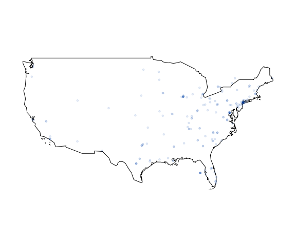

# Twitmo 

<!-- badges: start -->

[](https://cran.r-project.org/package=Twitmo)
[](https://github.com/abuchmueller/Twitmo/actions)
[](https://opensource.org/licenses/MIT)

<!-- badges: end -->

The goal of `Twitmo` is to facilitate topic modeling in R with Twitter
data. `Twitmo` provides a broad range of methods to sample, pre-process
and visualize contents of geo-tagged tweets to make modeling the public
discourse easy and accessible.

## Installation

## Important Note for **NEW** users

If you are using `Twitmo` for the first time, you might already have
`rtweet` installed. If you have `rtweet` version \>= 1.0.0 installed,
you will not be able to use certain parts of `Twitmo`, like
parsing/loading tweets because of breaking changes in `rtweet`. I am
currently working on a solution but for now, make sure you have the
correct version of `rtweet` installed by running

``` r
## install remotes package if it's not already
if (!requireNamespace("devtools", quietly = TRUE)) {
  install.packages("devtools")
}

devtools::install_version("rtweet", version = "0.7.0", repos = "http://cran.us.r-project.org")
```

You can install `Twitmo` from CRAN with:

``` r
install.packages("Twitmo")
```

or install from Github where the correct version of `rtweet` will
automatically be installed.

You can install `Twitmo` from Github with:

**Note**: Installing from Github may require you to have Rtools on your
system.

-   [Windows](https://cran.r-project.org/bin/windows/Rtools/ "Rtools for Windows (CRAN)")

-   [macOS](https://thecoatlessprofessor.com/programming/cpp/r-compiler-tools-for-rcpp-on-macos/ "Rtools for macOS")

``` r
## install remotes package if it's not already
if (!requireNamespace("remotes", quietly = TRUE)) {
  install.packages("remotes")
}

## install dev version of Twitmo from github
remotes::install_github("abuchmueller/Twitmo")
```

## Collecting geo-tagged tweets

Make sure you have a regular Twitter Account before start to sample your
tweets.

``` r
# Live stream tweets from the UK for 30 seconds and save to "uk_tweets.json" in current working directory
get_tweets(method = 'stream', 
           location = "GBR", 
           timeout = 30, 
           file_name = "uk_tweets.json")

# Use your own bounding box to stream US mainland tweets
get_tweets(method = 'stream', 
           location = c(-125, 26, -65, 49), 
           timeout = 30,
           file_name = "tweets_from_us_mainland.json")
```

## Load your tweets from a json file into a data frame

A small sample with raw tweets is included in the package. Access via:

``` r
raw_path <- system.file("extdata", "tweets_20191027-141233.json", package = "Twitmo")
mytweets <- load_tweets(raw_path)
#>  Found 167 records... Found 193 records... Imported 193 records. Simplifying...
```

## Pool tweets into long pseudo-document

``` r
pool <- pool_tweets(mytweets)
#> 
#> 193 Tweets total
#> 158 Tweets without hashtag
#> Pooling 35 Tweets with hashtags #
#> 56 Unique hashtags total
#> Begin pooling ...Done
pool.corpus <- pool$corpus
pool.dfm <- pool$document_term_matrix
```

## Find optimal number of topics

``` r
find_lda(pool.dfm)
```

<!-- -->

## Fitting a LDA model

``` r
model <- fit_lda(pool.dfm, n_topics = 7)
```

## View most relevant terms for each topic

``` r
lda_terms(model)
#>          Topic.1  Topic.2    Topic.3    Topic.4                Topic.5 Topic.6 Topic.7
#> 1  tenrestaurant    paola   downtown       link                  music    meet      us
#> 2          crazy     says  knoxville        bio                morning  people    life
#> 3        covered    puppy       like        job                  early   first     see
#> 4         waffle    today     theres      click             photoshoot     big  church
#> 5         sooooo   laurel    nothing        see shamarathemodelscruggs  always   today
#> 6           time     glen      quite     hiring               allwomen    love  sunday
#> 7       birthday trailing         tn      great                   stay    last    yall
#> 8      girlhappy     oaks especially       care                  tuned   night morning
#> 9  birthdaytasha  tuscany       vols technician               fabulous     fun    word
#> 10          team       ii        win       life                holiday    good general
```

or which hashtags are heavily associated with each topic

``` r
lda_hashtags(model)
#>                      Topic
#> mood                     6
#> motivate                 4
#> healthcare               4
#> mrrbnsnathome            1
#> newyork                  1
#> breakfast                1
#> thisismyplace            7
#> p4l                      7
#> chinup                   2
#> sundayfunday             2
#> saintsgameday            2
#> instapuppy               2
#> woof                     2
#> tailswagging             2
#> tickfire                 6
#> msiclassic               1
#> nyc                      6
#> about                    6
#> joethecrane              6
#> government               7
#> ladystrut19              5
#> ladystrutaccessories     5
#> smartnews                5
#> sundaythoughts           7
#> sf100                    6
#> openhouse                2
#> springtx                 2
#> labor                    1
#> norfolk                  1
#> oprylandhotel            3
#> pharmaceutical           3
#> easthanover              4
#> sales                    4
#> scryingartist            4
#> beautifulskyz            4
#> knoxvilletn              3
#> downtownknoxville        3
#> heartofservice           1
#> youthmagnet              1
#> youthmentor              1
#> bonjour                  4
#> trump2020                3
#> spiritchat               7
#> columbia                 5
#> newcastle                7
#> oncology                 4
#> nbatwitter               1
#> detroit                  4
```

## Inspecting LDA distributions

Check the distribution of your LDA Model with

``` r
lda_distribution(model)
#>                         V1    V2    V3    V4    V5    V6    V7
#> mood                 0.001 0.001 0.001 0.001 0.001 0.994 0.001
#> motivate             0.001 0.001 0.001 0.992 0.001 0.001 0.001
#> healthcare           0.001 0.001 0.001 0.995 0.001 0.001 0.001
#> mrrbnsnathome        0.986 0.002 0.002 0.002 0.002 0.002 0.002
#> newyork              0.986 0.002 0.002 0.002 0.002 0.002 0.002
#> breakfast            0.986 0.002 0.002 0.002 0.002 0.002 0.002
#> thisismyplace        0.001 0.001 0.001 0.001 0.001 0.001 0.992
#> p4l                  0.001 0.001 0.001 0.001 0.001 0.001 0.992
#> chinup               0.005 0.973 0.005 0.005 0.005 0.005 0.005
#> sundayfunday         0.005 0.973 0.005 0.005 0.005 0.005 0.005
#> saintsgameday        0.005 0.973 0.005 0.005 0.005 0.005 0.005
#> instapuppy           0.005 0.973 0.005 0.005 0.005 0.005 0.005
#> woof                 0.005 0.973 0.005 0.005 0.005 0.005 0.005
#> tailswagging         0.005 0.973 0.005 0.005 0.005 0.005 0.005
#> tickfire             0.001 0.001 0.001 0.001 0.001 0.995 0.001
#> msiclassic           0.993 0.001 0.001 0.001 0.001 0.001 0.001
#> nyc                  0.001 0.001 0.001 0.001 0.001 0.995 0.001
#> about                0.001 0.001 0.001 0.001 0.001 0.995 0.001
#> joethecrane          0.001 0.001 0.001 0.001 0.001 0.995 0.001
#> government           0.001 0.001 0.001 0.467 0.001 0.001 0.528
#> ladystrut19          0.001 0.001 0.001 0.001 0.995 0.001 0.001
#> ladystrutaccessories 0.001 0.001 0.001 0.001 0.995 0.001 0.001
#> smartnews            0.001 0.001 0.001 0.001 0.996 0.001 0.001
#> sundaythoughts       0.001 0.001 0.001 0.001 0.001 0.001 0.996
#> sf100                0.001 0.001 0.001 0.001 0.001 0.994 0.001
#> openhouse            0.000 0.997 0.000 0.000 0.000 0.000 0.000
#> springtx             0.000 0.997 0.000 0.000 0.000 0.000 0.000
#> labor                0.629 0.001 0.001 0.366 0.001 0.001 0.001
#> norfolk              0.629 0.001 0.001 0.366 0.001 0.001 0.001
#> oprylandhotel        0.001 0.001 0.994 0.001 0.001 0.001 0.001
#> pharmaceutical       0.001 0.001 0.995 0.001 0.001 0.001 0.001
#> easthanover          0.001 0.001 0.001 0.995 0.001 0.001 0.001
#> sales                0.001 0.001 0.001 0.995 0.001 0.001 0.001
#> scryingartist        0.001 0.001 0.001 0.995 0.001 0.001 0.001
#> beautifulskyz        0.001 0.001 0.001 0.995 0.001 0.001 0.001
#> knoxvilletn          0.001 0.001 0.993 0.001 0.001 0.001 0.001
#> downtownknoxville    0.001 0.001 0.993 0.001 0.001 0.001 0.001
#> heartofservice       0.979 0.003 0.003 0.003 0.003 0.003 0.003
#> youthmagnet          0.979 0.003 0.003 0.003 0.003 0.003 0.003
#> youthmentor          0.979 0.003 0.003 0.003 0.003 0.003 0.003
#> bonjour              0.001 0.001 0.001 0.992 0.001 0.001 0.001
#> trump2020            0.001 0.001 0.992 0.001 0.001 0.001 0.001
#> spiritchat           0.001 0.001 0.001 0.001 0.001 0.001 0.996
#> columbia             0.001 0.001 0.001 0.001 0.995 0.001 0.001
#> newcastle            0.001 0.001 0.001 0.001 0.001 0.001 0.996
#> oncology             0.001 0.001 0.001 0.994 0.001 0.001 0.001
#> nbatwitter           0.996 0.001 0.001 0.001 0.001 0.001 0.001
#> detroit              0.001 0.001 0.001 0.994 0.001 0.001 0.001
```

# Filtering tweets

Sometimes you can build better topic models by blacklisting or
whitelisting certain keywords from your data. You can do this with a
keyword dictionary using the `filter_tweets()` function. In this example
we exclude all tweets with “football” or “mood” in them from our data.

``` r
mytweets %>% dim()
#> [1] 193  92
filter_tweets(mytweets, keywords = "football,mood", include = FALSE) %>% dim()
#> [1] 183  92
```

Analogously if you want to run your collected tweets through a whitelist
use

``` r
mytweets %>% dim()
#> [1] 193  92
filter_tweets(mytweets, keywords = "football,mood", include = TRUE) %>% dim()
#> [1] 10 92
```

# Fitting a structural topic model (STM)

Structural topic models can be fitted with additional external
covariates. In this example we metadata that comes with the tweets such
as retweet count. This works with parsed unpooled tweets. Pre-processing
and fitting is done with one function.

``` r
stm_model <- fit_stm(mytweets, n_topics = 7, xcov = ~ retweet_count + followers_count + reply_count + quote_count + favorite_count,
                     remove_punct = TRUE,
                     remove_url = TRUE,
                     remove_emojis = TRUE,
                     stem = TRUE,
                     stopwords = "en")
```

STMs can be inspected via

``` r
summary(stm_model)
#> A topic model with 7 topics, 137 documents and a 324 word dictionary.
#> Topic 1 Top Words:
#>       Highest Prob: last, today, time, love, show, week, just 
#>       FREX: love, show, week, give, whole, today, alway 
#>       Lift: alway, band, fan, give, love, miss, monster 
#>       Score: stop, love, last, today, week, give, show 
#> Topic 2 Top Words:
#>       Highest Prob: see, job, bio, link, click, can, season 
#>       FREX: bio, link, click, hire, latest, follow, downtown 
#>       Lift: bio, link, allen, area, develop, downtown, embarrass 
#>       Score: area, bio, link, job, click, hire, see 
#> Topic 3 Top Words:
#>       Highest Prob: like, one, year, want, think, read, win 
#>       FREX: year, way, around, parti, ppl, one, match 
#>       Lift: around, father, parti, ppl, pretti, start, throughout 
#>       Score: parti, one, year, like, way, ppl, match 
#> Topic 4 Top Words:
#>       Highest Prob: happen, life, right, now, say, need, hear 
#>       FREX: need, keep, action, support, work, right, hear 
#>       Lift: ’ve, action, difficult, footbal, head, keep, liter 
#>       Score: support, happen, say, now, need, life, action 
#> Topic 5 Top Words:
#>       Highest Prob: trump, know, peopl, game, best, presid, look 
#>       FREX: trump, know, care, got, intellig, isi, best 
#>       Lift: baghdadi, better, bin, fail, grow, person, sport 
#>       Score: isi, know, trump, care, intellig, presid, truth 
#> Topic 6 Top Words:
#>       Highest Prob: get, help, come, take, place, team, can 
#>       FREX: help, pleas, hors, colleg, communiti, made, question 
#>       Lift: hors, pleas, anytim, awesom, benefit, colleg, communiti 
#>       Score: made, help, hors, anytim, eddi, floyd, ranch 
#> Topic 7 Top Words:
#>       Highest Prob: will, sunday, day, live, morn, school, feel 
#>       FREX: day, live, morn, feel, fun, good, put 
#>       Lift: coffe, husband, ice, ladi, morn, park, realli 
#>       Score: feel, day, will, morn, live, sunday, put
```

## Visualizing models with `LDAvis`

Make sure you have `LDAvis` and `servr` installed.

``` r
## install LDAvis package if it's not already
if (!requireNamespace("LDAvis", quietly = TRUE)) {
  install.packages("LDAvis")
}

## install servr package if it's not already
if (!requireNamespace("servr", quietly = TRUE)) {
  install.packages("servr")
}
```

Export fitted models into interactive `LDAvis` visualizations with one
line of code

``` r
to_ldavis(model, pool.corpus, pool.dfm)
## for STM use (included in the stm package)
stm::toLDAvis(stm_model, stm_model$prep$documents)
```


## Plotting geo-tagged tweets

Plot your tweets onto a static map

``` r
plot_tweets(mytweets, region = "USA(?!:Alaska|:Hawaii)", alpha=0.1)
```

<!-- -->

or plot the distribution of a certain hashtag onto a static map (UK data
not included)

``` r
plot_hashtag(uk_tweets, region = "UK", hashtag = "foodwaste", ignore_case=TRUE, alpha=0.2)
```


## Interactive maps with `leaflet`

Use scroll wheel to zoom into and out of the map. Click markets to see
tweets. Make sure you have the `leaflet` package installed.

``` r
## install leaflet package if it's not already
if (!requireNamespace("leaflet", quietly = TRUE)) {
  install.packages("leaflet")
}

cluster_tweets(mytweets)
```


