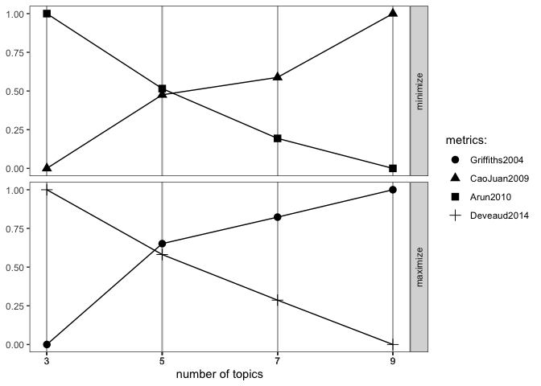

# TweetLocViz 

<!-- badges: start -->
<!-- badges: end -->

The goal of `TweetLocViz` is to facilitate topic modeling in R with
Twitter data. `TweetLocViz` provides a broad range of methods to sample,
pre-process and visualize Tweets to make modeling the public discourse
easy and accessible. This `README` covers the most important features.
For more details use `vignette("TweetLocViz")`.

## Installation

You can install `TweetLocViz` from CRAN with:

``` r
install.packages("TweetLocViz")
```

You can install `TweetLocViz` from github with:

Before you install from Github make sure you have Rtools for
[Windows](https://cran.r-project.org/bin/windows/Rtools/ "Rtools for Windows (CRAN)")
or
[macOS](https://thecoatlessprofessor.com/programming/cpp/r-compiler-tools-for-rcpp-on-macos/ "Rtools for macOS")
already installed.

``` r
## install remotes package if it's not already
if (!requireNamespace("remotes", quietly = TRUE)) {
  install.packages("remotes")
}

# YOU CAN CREATE YOUR GITHUB ACCESS TOKEN HERE
# https://github.com/settings/tokens
# PASTE THE STRING INTO THE AUTH_TOKEN ARGUMENT 

## install dev version of TweetLocViz from github
remotes::install_github("abuchmueller/TweetLocViz",
                        auth_token = "YOUR_TOKEN HERE")
```

## Example: Collect your tweets

Make sure you have a regular Twitter Account before start to sample your
Tweets. For more sophisticated sampling you’ll need a developer account.
Use `vignette("sampling", package = "TweetLocViz")` to learn more about
Twitter’s endpoints.

### Work in Progress: Use included examples for now as `get_tweets()` is not well documented.

``` r
# get_tweets()
```

## Parse your tweets

``` r
dat <- load_tweets("inst/extdata/tweets_20191027-141233.json")
#> opening file input connection.
#>  Found 167 records... Found 193 records... Imported 193 records. Simplifying...
#> closing file input connection.
```

## Pool tweets into document pools

``` r
pool <- pool_tweets(dat)
#> 
#> 193 Tweets total
#> 158 Tweets without hashtag
#> Pooling 35 Tweets with hashtags #
#> 56 Unique hashtags total
#> Begin pooling ...Done
pool.corpus <- pool$corpus
```

``` r
pool.dfm <- pool$document_term_matrix
```

## Find optimal number of topics

``` r
find_lda(pool.dfm)
#> Warning: `guides(<scale> = FALSE)` is deprecated. Please use `guides(<scale> = "none")` instead.
```

<!-- -->

## Fit LDA model

``` r
model <- fit_lda(pool.dfm, n_topics = 3)
```

## View most relevant terms for each topic

``` r
lda_terms(model)
#>     Topic.1         Topic.2   Topic.3
#> 1  birthday           paola       bio
#> 2      last            says      link
#> 3     music           puppy       job
#> 4      time           today       see
#> 5      meet             job     click
#> 6    people           crazy      like
#> 7     first         covered      life
#> 8       big          waffle  downtown
#> 9    always          sooooo knoxville
#> 10     love 9ten_restaurant       can
```

or which hashtags are heavily associated with each topic

``` r
lda_hashtags(model)
#>                      Topic
#> mood                     2
#> motivate                 2
#> healthcare               3
#> mrrbnsnathome            2
#> newyork                  2
#> breakfast                2
#> thisismyplace            3
#> p4l                      3
#> chinup                   2
#> sundayfunday             2
#> saintsgameday            2
#> instapuppy               2
#> woof                     2
#> tailswagging             2
#> tickfire                 1
#> msiclassic               2
#> nyc                      1
#> about                    1
#> joethecrane              1
#> government               3
#> ladystrut19              1
#> ladystrutaccessories     1
#> smartnews                3
#> sundaythoughts           2
#> sf100                    3
#> openhouse                2
#> springtx                 2
#> labor                    3
#> norfolk                  3
#> oprylandhotel            1
#> pharmaceutical           1
#> easthanover              2
#> sales                    2
#> scryingartist            3
#> beautifulskyz            3
#> knoxvilletn              3
#> downtownknoxville        3
#> heartofservice           1
#> youthmagnet              1
#> youthmentor              1
#> bonjour                  1
#> trump2020                2
#> spiritchat               1
#> columbia                 3
#> newcastle                2
#> oncology                 3
#> nbatwitter               3
#> detroit                  3
```

## LDA Distribution

Check the distribution of your LDA Model with

``` r
lda_distribution(model)
#>                         V1    V2    V3
#> mood                 0.001 0.997 0.001
#> motivate             0.002 0.996 0.002
#> healthcare           0.001 0.001 0.997
#> mrrbnsnathome        0.004 0.993 0.004
#> newyork              0.004 0.993 0.004
#> breakfast            0.004 0.993 0.004
#> thisismyplace        0.002 0.002 0.997
#> p4l                  0.002 0.002 0.997
#> chinup               0.007 0.986 0.007
#> sundayfunday         0.007 0.986 0.007
#> saintsgameday        0.007 0.986 0.007
#> instapuppy           0.007 0.986 0.007
#> woof                 0.007 0.986 0.007
#> tailswagging         0.007 0.986 0.007
#> tickfire             0.997 0.001 0.001
#> msiclassic           0.002 0.996 0.002
#> nyc                  0.998 0.001 0.001
#> about                0.998 0.001 0.001
#> joethecrane          0.998 0.001 0.001
#> government           0.001 0.001 0.997
#> ladystrut19          0.997 0.001 0.001
#> ladystrutaccessories 0.997 0.001 0.001
#> smartnews            0.001 0.001 0.998
#> sundaythoughts       0.001 0.998 0.001
#> sf100                0.001 0.001 0.997
#> openhouse            0.001 0.999 0.001
#> springtx             0.001 0.999 0.001
#> labor                0.002 0.002 0.997
#> norfolk              0.002 0.002 0.997
#> oprylandhotel        0.997 0.001 0.001
#> pharmaceutical       0.729 0.001 0.269
#> easthanover          0.001 0.997 0.001
#> sales                0.001 0.997 0.001
#> scryingartist        0.001 0.001 0.997
#> beautifulskyz        0.001 0.001 0.997
#> knoxvilletn          0.002 0.002 0.996
#> downtownknoxville    0.002 0.002 0.996
#> heartofservice       0.993 0.004 0.004
#> youthmagnet          0.993 0.004 0.004
#> youthmentor          0.993 0.004 0.004
#> bonjour              0.996 0.002 0.002
#> trump2020            0.002 0.996 0.002
#> spiritchat           0.998 0.001 0.001
#> columbia             0.001 0.001 0.997
#> newcastle            0.001 0.998 0.001
#> oncology             0.001 0.001 0.997
#> nbatwitter           0.001 0.001 0.998
#> detroit              0.002 0.002 0.997
```

## Visualize with `LDAvis`

Hint: Make sure you have `servr` package installed.

``` r
to_ldavis(model, pool.corpus, pool.dfm)
```
