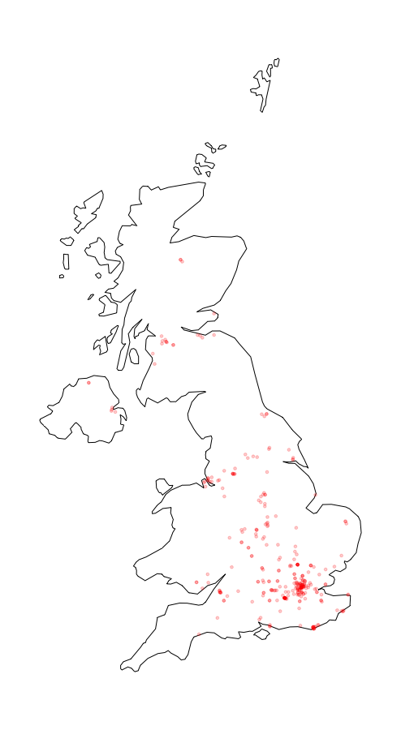

# Twitmo 

<!-- badges: start -->

[](https://github.com/abuchmueller/Twitmo/actions)
[](https://opensource.org/licenses/MIT)

<!-- badges: end -->

The goal of `Twitmo` is to facilitate topic modeling in R with Twitter
data. `Twitmo` provides a broad range of methods to sample, pre-process
and visualize contents of geo-tagged tweets to make modeling the public
discourse easy and accessible.

## Installation

You can install `Twitmo` from CRAN with:

``` r
install.packages("Twitmo")
```

You can install `Twitmo` from GitHub with:

Before you install from Github make sure you have Rtools for
[Windows](https://cran.r-project.org/bin/windows/Rtools/ "Rtools for Windows (CRAN)")
or
[macOS](https://thecoatlessprofessor.com/programming/cpp/r-compiler-tools-for-rcpp-on-macos/ "Rtools for macOS")
already installed.

``` r
## install remotes package if it's not already
if (!requireNamespace("remotes", quietly = TRUE)) {
  install.packages("remotes")
}

## install dev version of Twitmo from github
remotes::install_github("abuchmueller/Twitmo")
```

## Collecting geo-tagged tweets

Make sure you have a regular Twitter Account before start to sample your
tweets.

``` r
# Live stream tweets from the UK for 30 seconds and save to "uk_tweets.json" in current working directory
get_tweets(method = 'stream', 
           location = "GBR", 
           timeout = 30, 
           file_name = "uk_tweets.json")

# Use your own bounding box to stream US mainland tweets
get_tweets(method = 'stream', 
           location = c(-125, 26, -65, 49), 
           timeout = 30,
           file_name = "tweets_from_us_mainland.json")
```

## Load your tweets from a json file into a data frame

A small sample with raw tweets is included in the package. Access via:

``` r
raw_path <- system.file("extdata", "tweets_20191027-141233.json", package = "Twitmo")
mytweets <- load_tweets(raw_path)
#>  Found 167 records... Found 193 records... Imported 193 records. Simplifying...
```

## Pool tweets into long pseudo-document

``` r
pool <- pool_tweets(mytweets)
#> 
#> 193 Tweets total
#> 158 Tweets without hashtag
#> Pooling 35 Tweets with hashtags #
#> 56 Unique hashtags total
#> Begin pooling ...Done
pool.corpus <- pool$corpus
pool.dfm <- pool$document_term_matrix
```

## Find optimal number of topics

``` r
find_lda(pool.dfm)
```

<!-- -->

## Fitting a LDA model

``` r
model <- fit_lda(pool.dfm, n_topics = 7)
```

## View most relevant terms for each topic

``` r
lda_terms(model)
#>      Topic.1   Topic.2                Topic.3   Topic.4       Topic.5       Topic.6   Topic.7
#> 1        job  downtown                  music     today tenrestaurant         place      like
#> 2       link knoxville                   team    laurel         paola          life       job
#> 3        bio democrats                morning      glen          says          time      life
#> 4      click      jeff                 season  trailing         puppy      birthday beautiful
#> 5        see  sessions                  early      oaks            us     girlhappy   posting
#> 6       meet      like             photoshoot   tuscany         crazy birthdaytasha      olde
#> 7     people    theres shamarathemodelscruggs        ii       covered        church       end
#> 8        can   nothing               allwomen    design        waffle         today      days
#> 9  recommend     quite                   stay perfectly        sooooo           see    grains
#> 10    anyone        tn                  tuned     sized        church        sunday      sand
```

or which hashtags are heavily associated with each topic

``` r
lda_hashtags(model)
#>                      Topic
#> mood                     5
#> motivate                 3
#> healthcare               1
#> mrrbnsnathome            5
#> newyork                  5
#> breakfast                5
#> thisismyplace            6
#> p4l                      6
#> chinup                   5
#> sundayfunday             5
#> saintsgameday            5
#> instapuppy               5
#> woof                     5
#> tailswagging             5
#> tickfire                 1
#> msiclassic               3
#> nyc                      1
#> about                    1
#> joethecrane              1
#> government               5
#> ladystrut19              3
#> ladystrutaccessories     3
#> smartnews                2
#> sundaythoughts           6
#> sf100                    3
#> openhouse                4
#> springtx                 4
#> labor                    1
#> norfolk                  1
#> oprylandhotel            2
#> pharmaceutical           7
#> easthanover              1
#> sales                    1
#> scryingartist            7
#> beautifulskyz            7
#> knoxvilletn              2
#> downtownknoxville        2
#> heartofservice           6
#> youthmagnet              6
#> youthmentor              6
#> bonjour                  2
#> trump2020                7
#> spiritchat               5
#> columbia                 3
#> newcastle                7
#> oncology                 5
#> nbatwitter               6
#> detroit                  1
```

## Inspecting LDA distributions

Check the distribution of your LDA Model with

``` r
lda_distribution(model)
#>                         V1    V2    V3    V4    V5    V6    V7
#> mood                 0.001 0.001 0.001 0.001 0.996 0.001 0.001
#> motivate             0.001 0.001 0.995 0.001 0.001 0.001 0.001
#> healthcare           0.996 0.001 0.001 0.001 0.001 0.001 0.001
#> mrrbnsnathome        0.002 0.002 0.002 0.002 0.990 0.002 0.002
#> newyork              0.002 0.002 0.002 0.002 0.990 0.002 0.002
#> breakfast            0.002 0.002 0.002 0.002 0.990 0.002 0.002
#> thisismyplace        0.001 0.001 0.001 0.001 0.001 0.995 0.001
#> p4l                  0.001 0.001 0.001 0.001 0.001 0.995 0.001
#> chinup               0.003 0.003 0.003 0.003 0.980 0.003 0.003
#> sundayfunday         0.003 0.003 0.003 0.003 0.980 0.003 0.003
#> saintsgameday        0.003 0.003 0.003 0.003 0.980 0.003 0.003
#> instapuppy           0.003 0.003 0.003 0.003 0.980 0.003 0.003
#> woof                 0.003 0.003 0.003 0.003 0.980 0.003 0.003
#> tailswagging         0.003 0.003 0.003 0.003 0.980 0.003 0.003
#> tickfire             0.996 0.001 0.001 0.001 0.001 0.001 0.001
#> msiclassic           0.001 0.001 0.995 0.001 0.001 0.001 0.001
#> nyc                  0.997 0.001 0.001 0.001 0.001 0.001 0.001
#> about                0.997 0.001 0.001 0.001 0.001 0.001 0.001
#> joethecrane          0.997 0.001 0.001 0.001 0.001 0.001 0.001
#> government           0.001 0.001 0.001 0.001 0.996 0.001 0.001
#> ladystrut19          0.001 0.001 0.996 0.001 0.001 0.001 0.001
#> ladystrutaccessories 0.001 0.001 0.996 0.001 0.001 0.001 0.001
#> smartnews            0.001 0.997 0.001 0.001 0.001 0.001 0.001
#> sundaythoughts       0.000 0.000 0.000 0.000 0.000 0.997 0.000
#> sf100                0.001 0.001 0.996 0.001 0.001 0.001 0.001
#> openhouse            0.000 0.000 0.000 0.998 0.000 0.000 0.000
#> springtx             0.000 0.000 0.000 0.998 0.000 0.000 0.000
#> labor                0.996 0.001 0.001 0.001 0.001 0.001 0.001
#> norfolk              0.996 0.001 0.001 0.001 0.001 0.001 0.001
#> oprylandhotel        0.001 0.996 0.001 0.001 0.001 0.001 0.001
#> pharmaceutical       0.001 0.001 0.001 0.001 0.001 0.001 0.996
#> easthanover          0.996 0.001 0.001 0.001 0.001 0.001 0.001
#> sales                0.996 0.001 0.001 0.001 0.001 0.001 0.001
#> scryingartist        0.001 0.001 0.001 0.001 0.001 0.001 0.996
#> beautifulskyz        0.001 0.001 0.001 0.001 0.001 0.001 0.996
#> knoxvilletn          0.001 0.995 0.001 0.001 0.001 0.001 0.001
#> downtownknoxville    0.001 0.995 0.001 0.001 0.001 0.001 0.001
#> heartofservice       0.002 0.002 0.002 0.002 0.002 0.985 0.002
#> youthmagnet          0.002 0.002 0.002 0.002 0.002 0.985 0.002
#> youthmentor          0.002 0.002 0.002 0.002 0.002 0.985 0.002
#> bonjour              0.001 0.995 0.001 0.001 0.001 0.001 0.001
#> trump2020            0.001 0.001 0.001 0.001 0.001 0.001 0.995
#> spiritchat           0.001 0.001 0.001 0.001 0.997 0.001 0.001
#> columbia             0.001 0.001 0.996 0.001 0.001 0.001 0.001
#> newcastle            0.001 0.001 0.001 0.001 0.001 0.001 0.997
#> oncology             0.001 0.001 0.001 0.001 0.996 0.001 0.001
#> nbatwitter           0.000 0.000 0.000 0.000 0.000 0.997 0.000
#> detroit              0.995 0.001 0.001 0.001 0.001 0.001 0.001
```

# Filtering tweets

Sometimes you can build better topic models by blacklisting or
whitelisting certain keywords from your data. You can do this with a
keyword dictionary using the `filter_tweets()` function. In this example
we exclude all tweets with “football” or “mood” in them from our data.

``` r
mytweets %>% dim()
#> [1] 193  92
filter_tweets(mytweets, keywords = "football,mood", include = FALSE) %>% dim()
#> [1] 183  92
```

Analogously if you want to run your collected tweets through a whitelist
use

``` r
mytweets %>% dim()
#> [1] 193  92
filter_tweets(mytweets, keywords = "football,mood", include = TRUE) %>% dim()
#> [1] 10 92
```

# Fiting a STM

Structural topic models can be fitted with additional external
covariates. In this example we metadata that comes with the tweets such
as retweet count. This works with parsed unpooled tweets. Pre-processing
and fitting is done with one function.

``` r
stm_model <- fit_stm(mytweets, n_topics = 7, xcov = ~ retweet_count + followers_count + reply_count + quote_count + favorite_count,
                     remove_punct = TRUE,
                     remove_url = TRUE,
                     remove_emojis = TRUE,
                     stem = TRUE,
                     stopwords = "en")
```

STMs can be inspected via

``` r
summary(stm_model)
#> A topic model with 7 topics, 137 documents and a 324 word dictionary.
#> Topic 1 Top Words:
#>       Highest Prob: like, will, come, help, look, live, fun 
#>       FREX: hors, intellig, fun, come, enjoy, post, question 
#>       Lift: anytim, eddi, floyd, gameday, gave, hors, ranch 
#>       Score: stop, hors, will, come, like, help, anytim 
#> Topic 2 Top Words:
#>       Highest Prob: last, sunday, know, win, season, want, show 
#>       FREX: win, know, night, way, last, sunday, area 
#>       Lift: way, area, photo, three, night, win, boy 
#>       Score: area, last, win, sunday, night, know, action 
#> Topic 3 Top Words:
#>       Highest Prob: game, get, time, trump, can, just, love 
#>       FREX: game, love, week, al-baghdadi, parti, won, fuck 
#>       Lift: ’re, baghdadi, bin, counti, els, fail, import 
#>       Score: parti, game, love, trump, week, get, time 
#> Topic 4 Top Words:
#>       Highest Prob: one, day, today, open, church, even, life 
#>       FREX: church, rain, open, now, market, day, one 
#>       Lift: fat, finish, view, church, market, rain, special 
#>       Score: support, day, today, church, rain, open, one 
#> Topic 5 Top Words:
#>       Highest Prob: see, job, bio, link, click, might, best 
#>       FREX: job, bio, link, click, might, need, isi 
#>       Lift: bio, link, might, anyon, better, democrat, develop 
#>       Score: isi, bio, link, job, click, hire, recommend 
#> Topic 6 Top Words:
#>       Highest Prob: morn, place, first, read, team, bad, back 
#>       FREX: morn, place, colleg, lose, made, back, told 
#>       Lift: morn, place, back, championship, colleg, fall, famili 
#>       Score: made, morn, place, lose, found, colleg, huh 
#> Topic 7 Top Words:
#>       Highest Prob: think, say, school, feel, set, good, happen 
#>       FREX: feel, say, school, set, downtown, truth, anyth 
#>       Lift: anyth, benefit, excel, feel, talk, thank, yet 
#>       Score: feel, school, think, set, say, everyon, happen
```

## Visualizing models with `LDAvis`

Make sure you have `LDAvis` and `servr` installed.

``` r
## install LDAvis package if it's not already
if (!requireNamespace("LDAvis", quietly = TRUE)) {
  install.packages("LDAvis")
}

## install servr package if it's not already
if (!requireNamespace("servr", quietly = TRUE)) {
  install.packages("servr")
}
```

Export fitted models into interactive `LDAvis` visualizations with one
line of code

``` r
to_ldavis(model, pool.corpus, pool.dfm)
## for STM use (included in the stm package)
stm::toLDAvis(stm_model, stm_model$prep$documents)
```


## Plotting geo-tagged tweets

Plot your tweets onto a static map

``` r
plot_tweets(mytweets, region = "USA(?!:Alaska|:Hawaii)", alpha=0.1)
```

<!-- -->

or plot the distribution of a certain hashtag onto a static map (UK data
not included)

``` r
plot_hashtag(uk_tweets, region = "UK", hashtag = "foodwaste", ignore_case=TRUE, alpha=0.2)
```



## Interactive maps with `leaflet`

Use scroll wheel to zoom into and out of the map. Click markets to see
tweets. Make sure you have the `leaflet` package installed.

``` r
## install leaflet package if it's not already
if (!requireNamespace("leaflet", quietly = TRUE)) {
  install.packages("leaflet")
}

cluster_tweets(mytweets)
```


