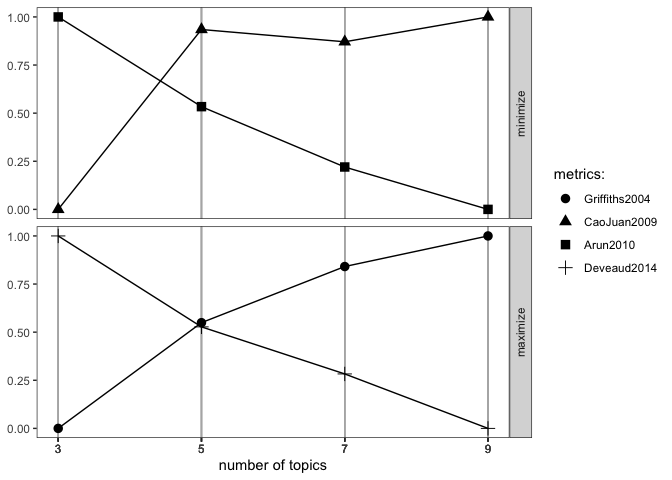

# Twitmo 

<!-- badges: start -->

[](https://github.com/abuchmueller/Twitmo/actions)
<!-- badges: end -->

The goal of `Twitmo` is to facilitate topic modeling in R with Twitter
data. `Twitmo` provides a broad range of methods to sample, pre-process
and visualize Tweets to make modeling the public discourse easy and
accessible. This `README` covers the most important features. For more
details use `vignette("Twitmo")`.

## Installation

You can install `Twitmo` from CRAN with:

``` r
install.packages("Twitmo")
```

You can install `Twitmo` from github with:

Before you install from Github make sure you have Rtools for
[Windows](https://cran.r-project.org/bin/windows/Rtools/ "Rtools for Windows (CRAN)")
or
[macOS](https://thecoatlessprofessor.com/programming/cpp/r-compiler-tools-for-rcpp-on-macos/ "Rtools for macOS")
already installed.

``` r
## install remotes package if it's not already
if (!requireNamespace("remotes", quietly = TRUE)) {
  install.packages("remotes")
}

# YOU CAN CREATE YOUR GITHUB ACCESS TOKEN HERE
# https://github.com/settings/tokens
# PASTE THE STRING INTO THE AUTH_TOKEN ARGUMENT 

## install dev version of Twitmo from github
remotes::install_github("abuchmueller/Twitmo",
                        auth_token = "YOUR_TOKEN HERE")
```

## Example: Collect your tweets

Make sure you have a regular Twitter Account before start to sample your
Tweets. For more sophisticated sampling you’ll need a developer account.
Use `vignette("sampling", package = "Twitmo")` to learn more about
Twitter’s endpoints.

### Work in Progress: Use included examples for now as `get_tweets()` is not well documented.

``` r
# get_tweets()
```

## Parse your tweets

``` r
dat <- load_tweets("inst/extdata/tweets_20191027-141233.json")
#> opening file input connection.
#>  Found 167 records... Found 193 records... Imported 193 records. Simplifying...
#> closing file input connection.
```

## Pool tweets into document pools

``` r
pool <- pool_tweets(dat)
#> 
#> 193 Tweets total
#> 158 Tweets without hashtag
#> Pooling 35 Tweets with hashtags #
#> 56 Unique hashtags total
#> Begin pooling ...Done
pool.corpus <- pool$corpus
```

``` r
pool.dfm <- pool$document_term_matrix
```

## Find optimal number of topics

``` r
find_lda(pool.dfm)
#> Warning: `guides(<scale> = FALSE)` is deprecated. Please use `guides(<scale> = "none")` instead.
```

<!-- -->

## Fit LDA model

``` r
model <- fit_lda(pool.dfm, n_topics = 3)
```

## View most relevant terms for each topic

``` r
lda_terms(model)
#>            Topic.1 Topic.2   Topic.3
#> 1         birthday   paola      link
#> 2            today    says       bio
#> 3             time   puppy       job
#> 4               us  people     click
#> 5             life    good       see
#> 6            crazy     see     music
#> 7          covered   first      like
#> 8           waffle    meet  downtown
#> 9           sooooo    last knoxville
#> 10 9ten_restaurant morning       can
```

or which hashtags are heavily associated with each topic

``` r
lda_hashtags(model)
#>                      Topic
#> mood                     1
#> motivate                 2
#> healthcare               2
#> mrrbnsnathome            1
#> newyork                  1
#> breakfast                1
#> thisismyplace            2
#> p4l                      2
#> chinup                   2
#> sundayfunday             2
#> saintsgameday            2
#> instapuppy               2
#> woof                     2
#> tailswagging             2
#> tickfire                 2
#> msiclassic               3
#> nyc                      2
#> about                    2
#> joethecrane              2
#> government               3
#> ladystrut19              3
#> ladystrutaccessories     3
#> smartnews                2
#> sundaythoughts           1
#> sf100                    2
#> openhouse                1
#> springtx                 1
#> labor                    3
#> norfolk                  3
#> oprylandhotel            1
#> pharmaceutical           3
#> easthanover              1
#> sales                    1
#> scryingartist            1
#> beautifulskyz            1
#> knoxvilletn              3
#> downtownknoxville        3
#> heartofservice           1
#> youthmagnet              1
#> youthmentor              1
#> bonjour                  1
#> trump2020                2
#> spiritchat               1
#> columbia                 3
#> newcastle                3
#> oncology                 3
#> nbatwitter               3
#> detroit                  2
```

## LDA Distribution

Check the distribution of your LDA Model with

``` r
lda_distribution(model)
#>                         V1    V2    V3
#> mood                 0.996 0.002 0.002
#> motivate             0.003 0.994 0.003
#> healthcare           0.002 0.503 0.495
#> mrrbnsnathome        0.989 0.005 0.005
#> newyork              0.989 0.005 0.005
#> breakfast            0.989 0.005 0.005
#> thisismyplace        0.002 0.995 0.002
#> p4l                  0.002 0.995 0.002
#> chinup               0.010 0.979 0.010
#> sundayfunday         0.010 0.979 0.010
#> saintsgameday        0.010 0.979 0.010
#> instapuppy           0.010 0.979 0.010
#> woof                 0.010 0.979 0.010
#> tailswagging         0.010 0.979 0.010
#> tickfire             0.002 0.996 0.002
#> msiclassic           0.003 0.003 0.995
#> nyc                  0.002 0.996 0.002
#> about                0.002 0.996 0.002
#> joethecrane          0.002 0.996 0.002
#> government           0.002 0.002 0.996
#> ladystrut19          0.002 0.002 0.996
#> ladystrutaccessories 0.002 0.002 0.996
#> smartnews            0.002 0.997 0.002
#> sundaythoughts       0.997 0.001 0.001
#> sf100                0.002 0.996 0.002
#> openhouse            0.998 0.001 0.001
#> springtx             0.998 0.001 0.001
#> labor                0.002 0.002 0.995
#> norfolk              0.002 0.002 0.995
#> oprylandhotel        0.996 0.002 0.002
#> pharmaceutical       0.002 0.002 0.996
#> easthanover          0.772 0.002 0.226
#> sales                0.772 0.002 0.226
#> scryingartist        0.996 0.002 0.002
#> beautifulskyz        0.996 0.002 0.002
#> knoxvilletn          0.003 0.003 0.994
#> downtownknoxville    0.003 0.003 0.994
#> heartofservice       0.989 0.005 0.005
#> youthmagnet          0.989 0.005 0.005
#> youthmentor          0.989 0.005 0.005
#> bonjour              0.994 0.003 0.003
#> trump2020            0.003 0.994 0.003
#> spiritchat           0.997 0.002 0.002
#> columbia             0.002 0.002 0.996
#> newcastle            0.002 0.002 0.996
#> oncology             0.002 0.002 0.996
#> nbatwitter           0.001 0.001 0.997
#> detroit              0.002 0.550 0.447
```

## Visualize with `LDAvis`

Hint: Make sure you have `servr` package installed.

``` r
to_ldavis(model, pool.corpus, pool.dfm)
```
