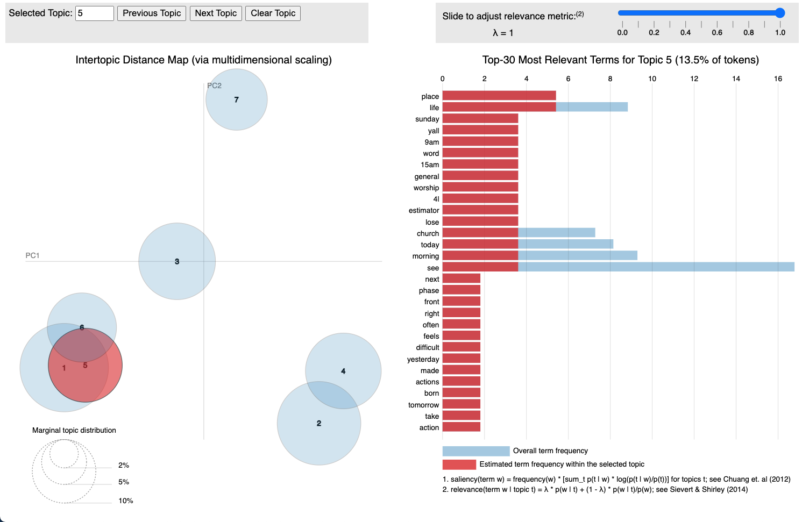

# Twitmo 

<!-- badges: start -->

[](https://github.com/abuchmueller/Twitmo/actions)
[](https://www.gnu.org/licenses/gpl-3.0)

<!-- badges: end -->

The goal of `Twitmo` is to facilitate topic modeling in R with Twitter
data. `Twitmo` provides a broad range of methods to sample, pre-process
and visualize Tweets to make modeling the public discourse easy and
accessible.

## Installation

You can install `Twitmo` from CRAN with:

``` r
install.packages("Twitmo")
```

You can install `Twitmo` from github with:

Before you install from Github make sure you have Rtools for
[Windows](https://cran.r-project.org/bin/windows/Rtools/ "Rtools for Windows (CRAN)")
or
[macOS](https://thecoatlessprofessor.com/programming/cpp/r-compiler-tools-for-rcpp-on-macos/ "Rtools for macOS")
already installed.

``` r
## install remotes package if it's not already
if (!requireNamespace("remotes", quietly = TRUE)) {
  install.packages("remotes")
}

## install dev version of Twitmo from github
remotes::install_github("abuchmueller/Twitmo")
```

## Example: Collect geo-tagged tweets

Make sure you have a regular Twitter Account before start to sample your
Tweets.

``` r
# Live stream Tweets from the UK for 30 seconds and save to "uk_tweets.json" in current working directory
get_tweets(method = 'stream', 
           location = "GBR", 
           timeout = 30, 
           file_name = "uk_tweets.json")

# Use your own bounding box to stream US mainland Tweets
get_tweets(method = 'stream', 
           location = c(-125, 26, -65, 49), 
           timeout = 30,
           file_name = "tweets_from_us_mainland.json")
```

## Parse your tweets from a json file

A small sample with raw tweets is included in the package. Access via:

``` r
raw_path <- system.file("extdata", "tweets_20191027-141233.json", package = "Twitmo")
mytweets <- load_tweets(raw_path)
#>  Found 167 records... Found 193 records... Imported 193 records. Simplifying...
```

## Pool tweets into document pools

``` r
pool <- pool_tweets(mytweets)
#> 
#> 193 Tweets total
#> 158 Tweets without hashtag
#> Pooling 35 Tweets with hashtags #
#> 56 Unique hashtags total
#> Begin pooling ...Done
pool.corpus <- pool$corpus
pool.dfm <- pool$document_term_matrix
```

## Find optimal number of topics

``` r
find_lda(pool.dfm)
```

<!-- -->

## Fit LDA model

``` r
model <- fit_lda(pool.dfm, n_topics = 7)
```

## View most relevant terms for each topic

``` r
lda_terms(model)
#>      Topic.1   Topic.2       Topic.3 Topic.4   Topic.5   Topic.6 Topic.7
#> 1       like       see tenrestaurant   first     today       see      us
#> 2   downtown     click         paola   music democrats      team  church
#> 3  knoxville       job          says    meet      jeff      lose    vote
#> 4      today      link         puppy  people  sessions        ne    even
#> 5        job       bio           job     big    laurel   handler  though
#> 6        now      life          link  always      glen   package raining
#> 7     theres     great           bio    love  trailing    worker outside
#> 8    nothing      time         crazy    last      oaks       ups   still
#> 9      quite  birthday       covered   night   tuscany warehouse   today
#> 10        tn girlhappy        waffle     fun        ii       can    meet
```

or which hashtags are heavily associated with each topic

``` r
lda_hashtags(model)
#>                      Topic
#> mood                     7
#> motivate                 6
#> healthcare               2
#> mrrbnsnathome            3
#> newyork                  3
#> breakfast                3
#> thisismyplace            2
#> p4l                      2
#> chinup                   3
#> sundayfunday             3
#> saintsgameday            3
#> instapuppy               3
#> woof                     3
#> tailswagging             3
#> tickfire                 6
#> msiclassic               4
#> nyc                      4
#> about                    4
#> joethecrane              4
#> government               2
#> ladystrut19              4
#> ladystrutaccessories     4
#> smartnews                5
#> sundaythoughts           1
#> sf100                    5
#> openhouse                5
#> springtx                 5
#> labor                    6
#> norfolk                  6
#> oprylandhotel            3
#> pharmaceutical           1
#> easthanover              3
#> sales                    3
#> scryingartist            2
#> beautifulskyz            2
#> knoxvilletn              1
#> downtownknoxville        1
#> heartofservice           2
#> youthmagnet              2
#> youthmentor              2
#> bonjour                  7
#> trump2020                7
#> spiritchat               7
#> columbia                 4
#> newcastle                1
#> oncology                 2
#> nbatwitter               6
#> detroit                  3
```

## LDA distribution

Check the distribution of your LDA Model with

``` r
lda_distribution(model)
#>                         V1    V2    V3    V4    V5    V6    V7
#> mood                 0.001 0.001 0.001 0.001 0.001 0.001 0.995
#> motivate             0.001 0.001 0.001 0.001 0.001 0.993 0.001
#> healthcare           0.001 0.996 0.001 0.001 0.001 0.001 0.001
#> mrrbnsnathome        0.002 0.002 0.988 0.002 0.002 0.002 0.002
#> newyork              0.002 0.002 0.988 0.002 0.002 0.002 0.002
#> breakfast            0.002 0.002 0.988 0.002 0.002 0.002 0.002
#> thisismyplace        0.001 0.993 0.001 0.001 0.001 0.001 0.001
#> p4l                  0.001 0.993 0.001 0.001 0.001 0.001 0.001
#> chinup               0.004 0.004 0.975 0.004 0.004 0.004 0.004
#> sundayfunday         0.004 0.004 0.975 0.004 0.004 0.004 0.004
#> saintsgameday        0.004 0.004 0.975 0.004 0.004 0.004 0.004
#> instapuppy           0.004 0.004 0.975 0.004 0.004 0.004 0.004
#> woof                 0.004 0.004 0.975 0.004 0.004 0.004 0.004
#> tailswagging         0.004 0.004 0.975 0.004 0.004 0.004 0.004
#> tickfire             0.001 0.001 0.001 0.001 0.001 0.996 0.001
#> msiclassic           0.001 0.001 0.001 0.994 0.001 0.001 0.001
#> nyc                  0.001 0.001 0.001 0.996 0.001 0.001 0.001
#> about                0.001 0.001 0.001 0.996 0.001 0.001 0.001
#> joethecrane          0.001 0.001 0.001 0.996 0.001 0.001 0.001
#> government           0.001 0.995 0.001 0.001 0.001 0.001 0.001
#> ladystrut19          0.001 0.001 0.001 0.996 0.001 0.001 0.001
#> ladystrutaccessories 0.001 0.001 0.001 0.996 0.001 0.001 0.001
#> smartnews            0.001 0.001 0.001 0.001 0.996 0.001 0.001
#> sundaythoughts       0.997 0.001 0.001 0.001 0.001 0.001 0.001
#> sf100                0.001 0.001 0.001 0.001 0.995 0.001 0.001
#> openhouse            0.000 0.000 0.000 0.000 0.997 0.000 0.000
#> springtx             0.000 0.000 0.000 0.000 0.997 0.000 0.000
#> labor                0.001 0.360 0.001 0.001 0.001 0.635 0.001
#> norfolk              0.001 0.360 0.001 0.001 0.001 0.635 0.001
#> oprylandhotel        0.001 0.001 0.995 0.001 0.001 0.001 0.001
#> pharmaceutical       0.995 0.001 0.001 0.001 0.001 0.001 0.001
#> easthanover          0.001 0.001 0.995 0.001 0.001 0.001 0.001
#> sales                0.001 0.001 0.995 0.001 0.001 0.001 0.001
#> scryingartist        0.001 0.995 0.001 0.001 0.001 0.001 0.001
#> beautifulskyz        0.001 0.995 0.001 0.001 0.001 0.001 0.001
#> knoxvilletn          0.994 0.001 0.001 0.001 0.001 0.001 0.001
#> downtownknoxville    0.994 0.001 0.001 0.001 0.001 0.001 0.001
#> heartofservice       0.003 0.981 0.003 0.003 0.003 0.003 0.003
#> youthmagnet          0.003 0.981 0.003 0.003 0.003 0.003 0.003
#> youthmentor          0.003 0.981 0.003 0.003 0.003 0.003 0.003
#> bonjour              0.001 0.001 0.001 0.001 0.001 0.001 0.993
#> trump2020            0.001 0.001 0.001 0.001 0.001 0.001 0.993
#> spiritchat           0.001 0.001 0.001 0.001 0.001 0.001 0.996
#> columbia             0.001 0.001 0.001 0.995 0.001 0.001 0.001
#> newcastle            0.996 0.001 0.001 0.001 0.001 0.001 0.001
#> oncology             0.001 0.995 0.001 0.001 0.001 0.001 0.001
#> nbatwitter           0.001 0.001 0.001 0.001 0.001 0.997 0.001
#> detroit              0.001 0.001 0.994 0.001 0.001 0.001 0.001
```

# Filtering tweets

Sometimes you can build better topic models by blacklisting or
whitelisting certain keywords from your data. You can do this with a
keyword dictionary using the `filter_tweets()` function. In this example
we exclude all Tweets with “football” or “mood” in them from our data.

``` r
# Filter Tweets by blacklisting or whitelisting certain keywords
mytweets %>% dim()
#> [1] 193  93
filter_tweets(mytweets, keywords = "football,mood", include = FALSE) %>% dim()
#> [1] 183  93
```

Analogously if you want to run your collected tweets through a whitelist
use

``` r
mytweets %>% dim()
#> [1] 193  93
filter_tweets(mytweets, keywords = "football,mood", include = TRUE) %>% dim()
#> [1] 10 93
```

# Fit STM

Structural topic models can be fitted with additional external
covariates. In this example we metadata that comes with the Tweets such
as retweet count. This works with parsed unpooled Tweets. Pre-processing
and fitting is done with one function.

``` r
stm_model <- fit_stm(mytweets, n_topics = 7, xcov = ~ retweet_count + followers_count + reply_count + quote_count + favorite_count,
                     remove_punct = TRUE,
                     remove_url = TRUE,
                     remove_emojis = TRUE,
                     stem = TRUE,
                     stopwords = "en")
```

STMs can be inspected via

``` r
summary(stm_model)
#> A topic model with 7 topics, 137 documents and a 324 word dictionary.
#> Topic 1 Top Words:
#>       Highest Prob: like, will, come, help, look, live, fun 
#>       FREX: hors, intellig, fun, come, enjoy, post, question 
#>       Lift: anytim, eddi, floyd, gameday, gave, hors, ranch 
#>       Score: stop, hors, will, come, like, help, anytim 
#> Topic 2 Top Words:
#>       Highest Prob: last, sunday, know, win, season, want, show 
#>       FREX: win, know, night, way, last, sunday, area 
#>       Lift: way, area, photo, three, night, win, boy 
#>       Score: area, last, win, sunday, night, know, action 
#> Topic 3 Top Words:
#>       Highest Prob: game, get, time, trump, can, just, love 
#>       FREX: game, love, week, al-baghdadi, parti, won, fuck 
#>       Lift: ’re, baghdadi, bin, counti, els, fail, import 
#>       Score: parti, game, love, trump, week, get, time 
#> Topic 4 Top Words:
#>       Highest Prob: one, day, today, open, church, even, life 
#>       FREX: church, rain, open, now, market, day, one 
#>       Lift: fat, finish, view, church, market, rain, special 
#>       Score: support, day, today, church, rain, open, one 
#> Topic 5 Top Words:
#>       Highest Prob: see, job, bio, link, click, might, best 
#>       FREX: job, bio, link, click, might, need, isi 
#>       Lift: bio, link, might, anyon, better, democrat, develop 
#>       Score: isi, bio, link, job, click, hire, recommend 
#> Topic 6 Top Words:
#>       Highest Prob: morn, place, first, read, team, bad, back 
#>       FREX: morn, place, colleg, lose, made, back, told 
#>       Lift: morn, place, back, championship, colleg, fall, famili 
#>       Score: made, morn, place, lose, found, colleg, huh 
#> Topic 7 Top Words:
#>       Highest Prob: think, say, school, feel, set, good, happen 
#>       FREX: feel, say, school, set, downtown, truth, anyth 
#>       Lift: anyth, benefit, excel, feel, talk, thank, yet 
#>       Score: feel, school, think, set, say, everyon, happen
```

## Visualize with `LDAvis`

Make sure you have `servr` package installed.

``` r
to_ldavis(model, pool.corpus, pool.dfm)
## for STM use (included in the stm package)
stm::toLDAvis(stm_model, stm_model$prep$documents)
```


