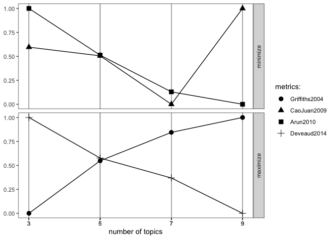

# TweetLocViz

The goal of `TweetLocViz` is to facilitate topic modeling in R with
Twitter data. `TweetLocViz` provides a broad range of methods to sample,
pre-process and visualize Tweets to make modeling the public discourse
easy and accessible. This `README` covers the most important features.
For more details use `vignette("TweetLocViz")`.

## Installation

You can install `TweetLocViz` from CRAN with:

``` r
install.packages("TweetLocViz")
```

You can install `TweetLocViz` from github with:

Before you install from github make sure you have Rtools for
[Windows](https://cran.r-project.org/bin/windows/Rtools/ "Rtools for Windows (CRAN)")
or
[macOS](https://thecoatlessprofessor.com/programming/cpp/r-compiler-tools-for-rcpp-on-macos/ "Rtools for macOS")
already installed.

``` r
## install remotes package if it's not already
if (!requireNamespace("remotes", quietly = TRUE)) {
  install.packages("remotes")
}

# YOU CAN CREATE YOUR GITHUB ACCESS TOKEN HERE
# https://github.com/settings/tokens
# PASTE THE STRING INTO THE AUTH_TOKEN ARGUMENT 

## install dev version of TweetLocViz from github
remotes::install_github("abuchmueller/TweetLocViz",
                        auth_token = "YOUR_TOKEN HERE")
```

## Example: Collect your tweets

Make sure you have a regular Twitter Account before start to sample your
Tweets. For more sophisticated sampling you’ll need a developer account.
Use `vignette("sampling", package = "TweetLocViz")` to learn more about
Twitter’s endpoints.

### Work in Progress: Use included examples for now as `get_tweets()` is not well documented.

``` r
# get_tweets()
```

## Parse your tweets

``` r
dat <- load_tweets("inst/extdata/tweets 20191027-141233.json")
#> opening file input connection.
#>  Found 167 records... Found 193 records... Imported 193 records. Simplifying...
#> closing file input connection.
```

## Pool tweets into document pools

``` r
pool <- pool_tweets(dat)
#> 
#> 193 Tweets total
#> 158 Tweets have no Hashtag
#> Pooling 35 Tweets with Hashtags #
#> 56 Unique Hashtags total
#> Begin pooling ...Done
pool.corpus <- pool$corpus
```

``` r
pool.dfm <- pool$document_term_matrix
```

## Find optimal number of topics

``` r
find_lda(pool.dfm)
```

<!-- -->

## Fit LDA model

``` r
model <- fit_lda(pool.dfm, n_topics = 3)
```

## View most relevant terms for each topic

``` r
lda_terms(model)
#>                    Topic.1        Topic.2 Topic.3
#> 1                    puppy          https     tco
#> 2            puppiesatplay            tco   https
#> 3                    https         waffle     job
#> 4                      tco 9tenrestaurant    link
#> 5                    paola           good     bio
#> 6                     says          music   click
#> 7                   chinup           like     see
#> 8             sundayfunday       downtown  church
#> 9  saintsgamedayinstapuppy      knoxville   great
#> 10                    woof           meet   today
```

or which hashtags are heavily associated with each topic

``` r
lda_hashtags(model)
#>                      Topic
#> mood                     3
#> motivate                 3
#> healthcare               3
#> mrrbnsnathome            2
#> newyork                  2
#> breakfast                2
#> thisismyplace            3
#> p4l                      3
#> chinup                   1
#> sundayfunday             1
#> saintsgameday            1
#> instapuppy               1
#> woof                     1
#> tailswagging             1
#> tickfire                 2
#> msiclassic               3
#> nyc                      2
#> about                    2
#> joethecrane              2
#> government               3
#> ladystrut19              2
#> ladystrutaccessories     2
#> smartnews                3
#> sundaythoughts           3
#> sf100                    2
#> openhouse                2
#> springtx                 2
#> labor                    3
#> norfolk                  3
#> oprylandhotel            1
#> pharmaceutical           3
#> easthanover              1
#> sales                    1
#> scryingartist            2
#> beautifulskyz            2
#> knoxvilletn              2
#> downtownknoxville        2
#> heartofservice           1
#> youthmagnet              1
#> youthmentor              1
#> bonjour                  3
#> trump2020                2
#> spiritchat               3
#> columbia                 3
#> newcastle                1
#> oncology                 3
#> nbatwitter               1
#> detroit                  3
```

## LDA Distribution

Check the distribution of your LDA Model with

``` r
lda_distribution(model)
#>                         V1    V2    V3
#> mood                 0.001 0.001 0.999
#> motivate             0.001 0.001 0.998
#> healthcare           0.001 0.001 0.998
#> mrrbnsnathome        0.001 0.998 0.001
#> newyork              0.001 0.998 0.001
#> breakfast            0.001 0.998 0.001
#> thisismyplace        0.001 0.001 0.997
#> p4l                  0.001 0.001 0.997
#> chinup               0.998 0.001 0.001
#> sundayfunday         0.998 0.001 0.001
#> saintsgameday        0.998 0.001 0.001
#> instapuppy           0.998 0.001 0.001
#> woof                 0.998 0.001 0.001
#> tailswagging         0.998 0.001 0.001
#> tickfire             0.001 0.998 0.001
#> msiclassic           0.001 0.001 0.999
#> nyc                  0.001 0.999 0.001
#> about                0.001 0.999 0.001
#> joethecrane          0.001 0.999 0.001
#> government           0.001 0.001 0.998
#> ladystrut19          0.001 0.998 0.001
#> ladystrutaccessories 0.001 0.998 0.001
#> smartnews            0.001 0.001 0.998
#> sundaythoughts       0.001 0.001 0.999
#> sf100                0.001 0.998 0.001
#> openhouse            0.001 0.999 0.001
#> springtx             0.001 0.999 0.001
#> labor                0.001 0.001 0.998
#> norfolk              0.001 0.001 0.998
#> oprylandhotel        0.998 0.001 0.001
#> pharmaceutical       0.001 0.001 0.998
#> easthanover          0.998 0.001 0.001
#> sales                0.998 0.001 0.001
#> scryingartist        0.001 0.998 0.001
#> beautifulskyz        0.001 0.998 0.001
#> knoxvilletn          0.001 0.998 0.001
#> downtownknoxville    0.001 0.998 0.001
#> heartofservice       0.998 0.001 0.001
#> youthmagnet          0.998 0.001 0.001
#> youthmentor          0.998 0.001 0.001
#> bonjour              0.001 0.001 0.998
#> trump2020            0.001 0.997 0.001
#> spiritchat           0.001 0.001 0.998
#> columbia             0.001 0.001 0.998
#> newcastle            0.998 0.001 0.001
#> oncology             0.001 0.001 0.998
#> nbatwitter           0.999 0.001 0.001
#> detroit              0.001 0.001 0.998
```

## Visualize with `LDAvis`

Hint: Make sure you have `servr` package installed.

``` r
to_ldavis(model, pool.corpus, pool.dfm)
```
